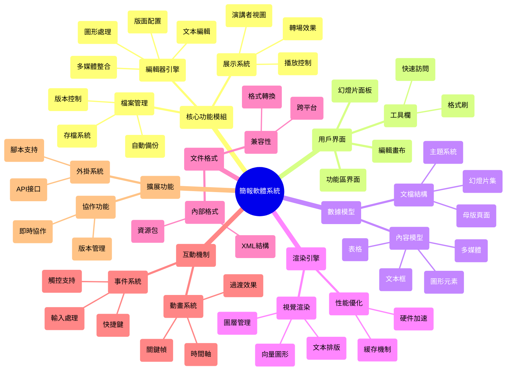

# 簡報軟體系統分析心智圖

## 如何查看圖形化的心智圖：

1. 在 VS Code 中，您需要安裝 "Markdown Preview Mermaid Support" 擴展
2. 安裝後，點擊編輯器右上角的 "預覽" 按鈕（或按 Ctrl+Shift+V）
3. 您就能看到上面的代碼渲染成圖形化的心智圖

或者您可以：
1. 訪問 [Mermaid Live Editor](https://mermaid.live)
2. 將上述 mermaid 代碼段複製到編輯器中
3. 即可看到實時渲染的心智圖

這個圖形化的版本更直觀地展示了簡報軟體的各個組件之間的關係和層級結構。